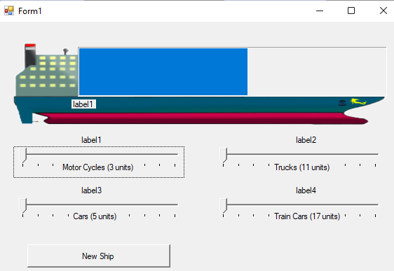
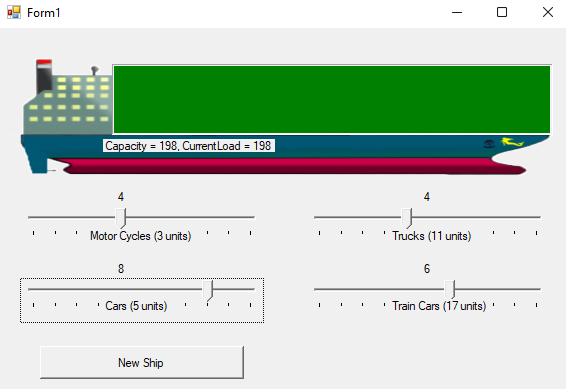
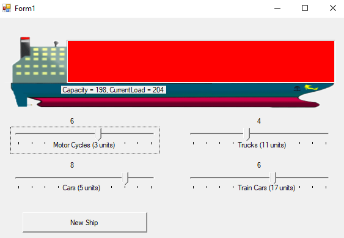

# CargoShip Loader

CargoShip Loader is a mini game using C#. Need to load the cargoship until reach it maximum capacity. There four types of vehicles able o load to the ship and various weight values are assigned for particular vehicle cateories.
- Motor Cycle (3 units)
- Cars (5 units)
- Trucks (11 units)
- Train Cars (17 units)

## Screen Shots
 
 
 
